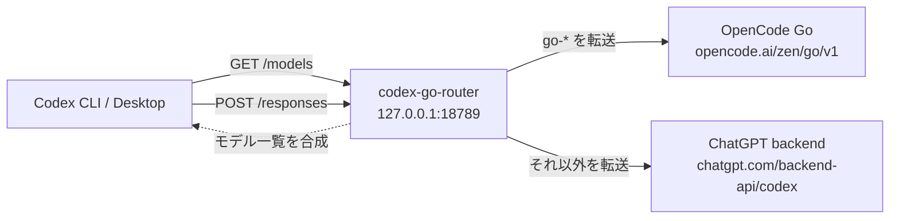

# codex-opencode-router

Codex はプロバイダを同時に1つしか使えないため、モデル一覧には「ChatGPT のモデル」か「OpenCode Go のモデル」のどちらかしか出せません。このリポジトリは、その制約をループバックの中継サーバーで回避する小さなリレーです。

- `GET /models` … ChatGPT のモデルカタログを取得し、OpenCode Go のモデルを追記して返す
- `POST /responses` … モデル名が `go-` で始まれば OpenCode Go へ、それ以外は ChatGPT へ転送する

Codex 側は `model_provider = "local-router"` を向くだけで、通常の GPT モデルと OpenCode Go のモデルを同じモデル一覧から選べます。



---

# AI エージェントによるセットアップ

この節は AI エージェントがそのまま実行できる手順です。ユーザーから

> https://github.com/mattyatea/codex-opencode-router のセットアップをして

と頼まれたら、この節に従って最後まで実行してください。

## 完了条件

以下がすべて満たされたら完了です。

1. `~/.codex/codex-go-router` にリポジトリが clone されている
2. `~/.codex/bin/codex-go-router` がビルドされている
3. ルーターが常駐し、`127.0.0.1:18789` で待ち受けている
4. `~/.codex/.env` に `OPENCODE_GO_API_KEY` がある（パーミッション 0600）
5. `~/.codex/config.toml` が `local-router` プロバイダを向いている
6. `codex debug models` の一覧に `go-deepseek-v4.1-flash` / `go-gpt-6-luna` / `go-muse-spark-1.3-contributor` が出る
7. `codex exec --model go-gpt-6-luna 'Reply with OK only.'` が応答する

## 手順

### 0. 前提を確認する

```sh
codex --version
go version || echo "go missing"
codex login status
```

- `go` が無ければインストールする（mise / asdf / apt / brew など、その環境の方法で）。
- `codex login status` が ChatGPT ログイン済みでなければ、セットアップの最後に `codex login` をユーザーへ依頼する。通常の GPT モデルには ChatGPT ログインが必要で、OpenCode Go のモデルだけならログインなしでも動く。

### 1. clone してビルドする

```sh
git clone https://github.com/mattyatea/codex-opencode-router.git ~/.codex/codex-go-router
cd ~/.codex/codex-go-router
go build -o ~/.codex/bin/codex-go-router .
```

### 2. OpenCode Go の API キーを設定する

`~/.codex/.env` にすでに `OPENCODE_GO_API_KEY` があればそのまま使う。無ければ**ユーザーにキーを確認してから**次を実行する（キーを推測したり、ログに残したりしない）。

```sh
umask 077
printf 'export OPENCODE_GO_API_KEY=%s\n' "<API キー>" >> ~/.codex/.env
```

### 3. ルーターを常駐させる

その環境で使える方法を上から順に選ぶ。

**systemd のユーザーサービス（Linux で推奨）**

```sh
mkdir -p ~/.config/systemd/user
cp ~/.codex/codex-go-router/deploy/codex-go-router.service ~/.config/systemd/user/
systemctl --user daemon-reload
systemctl --user enable --now codex-go-router.service
systemctl --user is-active codex-go-router.service
```

**launchd（macOS）** … `~/Library/LaunchAgents/` に `~/\.codex/bin/codex-go-router` を起動する plist を作って `launchctl load` する。

**どちらも無い場合** … `nohup ~/.codex/bin/codex-go-router >> ~/.codex/codex-go-router.log 2>&1 &` で常駐させ、可能ならシェルの起動処理やその環境のプロセス管理に登録する。

### 4. Codex の設定を local-router に向ける

`~/.codex/config.toml` を**必ずバックアップしてから**編集する。

```sh
cp ~/.codex/config.toml ~/.codex/config.toml.bak-codex-opencode-router
```

トップレベル（最初の `[table]` より前）に次を追加する。

```toml
model_provider = "local-router"
model_reasoning_summary = "auto"
```

末尾に次を追加する。

```toml
[model_providers.local-router]
name = "Local router"
base_url = "http://127.0.0.1:18789"
requires_openai_auth = true
wire_api = "responses"
supports_websockets = false
```

既存の `model_provider` や同じ名前のプロバイダ定義がある場合は、黙って置き換えず、**ユーザーに確認してから**上書きする。

### 5. 検証する

```sh
codex debug models   # go-* のモデルが一覧に出る
codex exec --model go-gpt-6-luna 'Reply with OK only.'
codex exec --model go-deepseek-v4.1-flash 'How much is 17*23? Think briefly.'
```

`codex exec` が動かない場合は `~/.codex/codex-go-router.log` か `systemctl --user status codex-go-router.service` のログを見て、原因を直してから再検証する。

### 6. 反映する

Codex デスクトップアプリや app-server が起動中なら再起動して設定を読み込ませる。CLI は次回起動から反映される。

### 7. 報告する

実行したコマンド、`codex debug models` の結果、動かなかった点と対処をユーザーに報告する。Muse Spark を使う場合だけ、後述の Privacy 設定が必要なことを伝える。

## つまずきやすい点

| 症状 | 原因と対処 |
| --- | --- |
| `codex debug models` に `go-*` が出ない | ルーターが起動していない。`systemctl --user status codex-go-router.service` とログを確認する |
| 通常の GPT モデルが `429 usage_limit_reached` | ChatGPT の使用枠上限。セットアップの失敗ではない。枠のリセットを待つ |
| Muse Spark が 400 | OpenCode のワークスペース設定で「学習に使われる有料エンドポイントを許可」をオンにする（https://dev.opencode.ai/auth ） |
| `codex exec` が 401 | ルーターの `/models` は ChatGPT の `Authorization` が必要。`codex login` 済みか確認する |
| `go build` が失敗する | Go のバージョンが古い。1.22 以上にする |
| ポート 18789 が使用中 | `ROUTER_LISTEN=127.0.0.1:18790` で起動し、`config.toml` の `base_url` も合わせる |

---

## 手動セットアップ（Linux の例）

```sh
git clone https://github.com/mattyatea/codex-opencode-router.git ~/.codex/codex-go-router
cd ~/.codex/codex-go-router
go build -o ~/.codex/bin/codex-go-router .

umask 077
printf 'export OPENCODE_GO_API_KEY=%s\n' "$OPENCODE_GO_API_KEY" >> ~/.codex/.env

mkdir -p ~/.config/systemd/user
cp deploy/codex-go-router.service ~/.config/systemd/user/
systemctl --user daemon-reload
systemctl --user enable --now codex-go-router.service
```

`~/.codex/config.toml` への追記は「AI エージェントによるセットアップ」の手順4と同じ。

## 設定

| 変数 | 既定値 | 説明 |
| --- | --- | --- |
| `OPENCODE_GO_API_KEY` | なし（必須） | `~/.codex/.env`、無ければプロセス環境変数から読む |
| `ROUTER_LISTEN` | `127.0.0.1:18789` | 待ち受けアドレス |
| `CODEX_HOME` | `~/.codex` | `.env` を探すディレクトリ |

## 対応モデル

`main.go` の `GO_MODELS` に定義しています。OpenCode Go 側で Responses API に対応しているモデルだけを載せてください（chat/completions 専用のモデルは `/responses` では 503 になります）。

| モデル ID | Codex での表示名 | 備考 |
| --- | --- | --- |
| `deepseek-v4.1-flash` | DeepSeek V4.1 Flash (OpenCode Go) | 生の reasoning を思考サマリーに変換して表示 |
| `gpt-6-luna` | GPT 6 Luna (OpenCode Go) | ネイティブの reasoning summary に対応 |
| `muse-spark-1.3-contributor` | opencode-go/muse-spark-1.3 (Train) | ワークスペースの Privacy 設定で学習許可が必要 |

## 注意

- OpenCode Go のモデルは `go-` 接頭辞で識別します。ChatGPT 側のカタログに同じ ID があっても衝突しません。
- DeepSeek 系は `reasoning_text` イベントを返すため、ルーターが Codex の描画する `reasoning_summary` イベントへ変換しています。
- ChatGPT の使用枠が上限に達していると、通常の GPT モデルは上流の 429 をそのまま返します。
- ルーターは 127.0.0.1 のみで待ち受け、認証はありません。マルチユーザーマシンでは注意してください。

## 開発

```sh
go vet ./...
go test ./...
```
