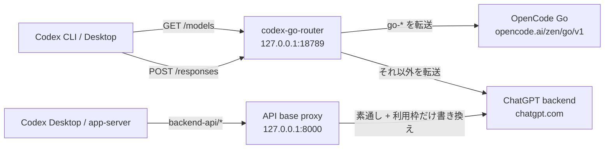

# codex-opencode-router

Codex のモデル一覧に ChatGPT のモデルと OpenCode Go のモデルを同時に出すためのローカル中継サーバーです。あわせて、ChatGPT の利用枠が上限に達していても Codex Desktop の送信ボタンが無効化されないように、バックエンド API の中継（利用枠レスポンスの書き換え）も行います。

- `GET /models` … ChatGPT のモデルカタログを取得し、OpenCode Go のモデルを追記して返す
- `POST /responses` … モデル名が `go-` で始まれば OpenCode Go へ、それ以外は ChatGPT へ転送する
- ChatGPT API ベース（`127.0.0.1:8000`）… Codex Desktop / Codex app-server のバックエンド呼び出しを中継し、利用枠（`/api/codex/usage` と `/wham/usage`）の応答だけを「制限なし」に書き換える。それ以外はそのまま `https://chatgpt.com` へ素通しする

Codex 側は `model_provider = "local-router"` を向け、デスクトップアプリには環境変数 `CODEX_API_BASE_URL=http://localhost:8000/backend-api` を渡すだけで、通常の GPT モデルと OpenCode Go のモデルを同じモデル一覧から選べます。OpenCode Go のモデルは ChatGPT の利用枠を消費しないため、ChatGPT 側の枠が尽きていても送信できます。



## AI エージェントにセットアップさせる

AI エージェント（Codex など）に任せる場合は、次のように伝えるだけで動きます。

> https://github.com/mattyatea/codex-opencode-router のセットアップをして

実行手順は [AGENTS.md](AGENTS.md) に定義しています。AI はこの README と AGENTS.md に従って、ビルド、常駐化、`~/.codex/config.toml` の設定、検証まで行います。AGENTS.md を直接読ませたい場合は https://raw.githubusercontent.com/mattyatea/codex-opencode-router/main/AGENTS.md を使ってください。

## 手動セットアップ（Linux の例）

```sh
git clone https://github.com/mattyatea/codex-opencode-router.git ~/.codex/codex-go-router
cd ~/.codex/codex-go-router
go build -o ~/.codex/bin/codex-go-router .

# API キー（Codex 本体と同じ .env を読む）
umask 077
printf 'export OPENCODE_GO_API_KEY=%s\n' "$OPENCODE_GO_API_KEY" >> ~/.codex/.env

mkdir -p ~/.config/systemd/user
cp deploy/codex-go-router.service ~/.config/systemd/user/
systemctl --user daemon-reload
systemctl --user enable --now codex-go-router.service
systemctl --user status codex-go-router.service
```

macOS では `~/Library/LaunchAgents/com.codex.go-router.plist` を作り、`ProgramArguments` に `/Users/<you>/.codex/bin/codex-go-router` を指定して `launchctl bootstrap gui/$(id -u) <plist>` します（`RunAtLoad` / `KeepAlive` を有効にし、ログは `~/.codex/codex-go-router.log` へ）。

## `~/.codex/config.toml` に追加する設定

```toml
model_provider = "local-router"
model_reasoning_summary = "auto"

[model_providers.local-router]
name = "Local router"
base_url = "http://127.0.0.1:18789"
requires_openai_auth = true
wire_api = "responses"
supports_websockets = false
```

## デスクトップアプリの API ベースをローカルへ向ける

Codex Desktop は環境変数 `CODEX_API_BASE_URL` を見てバックエンドの接続先を決めます。`/backend-api` まで含めて指定してください。

**macOS**

```sh
launchctl setenv CODEX_API_BASE_URL "http://localhost:8000/backend-api"
```

再ログイン後も維持するには `~/Library/LaunchAgents/com.codex.go-router-env.plist` を作り、`/bin/launchctl setenv CODEX_API_BASE_URL http://localhost:8000/backend-api` を `RunAtLoad` で実行します（`deploy/` に雛形があります）。

**Linux**

デスクトップエントリやシェルの起動処理で `export CODEX_API_BASE_URL=http://localhost:8000/backend-api` を設定します。

設定後に Codex Desktop を再起動すると、利用枠の取得が `127.0.0.1:8000` 経由になり、枠が上限でも送信ボタンがグレーアウトしなくなります。実際の GPT モデルはこれまで通り上流の 429 を返し、アプリが `Go/...` モデルへ自動フォールバックします。

## 動作確認

```sh
codex debug models        # go-* のモデルが一覧に出る
codex exec --model go-gpt-6-luna 'Reply with OK only.'
codex exec --model go-deepseek-v4.1-flash 'How much is 17*23? Think briefly.'

# 利用枠の中継が動いているか（Codex Desktop 起動後にログへ出る）
grep -E "wham/usage|api/codex/usage" ~/.codex/codex-go-router.log
```

## 設定

| 変数 | 既定値 | 説明 |
| --- | --- | --- |
| `OPENCODE_GO_API_KEY` | なし（必須） | `~/.codex/.env`、無ければプロセス環境変数から読む |
| `ROUTER_LISTEN` | `127.0.0.1:18789` | モデル中継の待ち受けアドレス |
| `ROUTER_API_LISTEN` | `127.0.0.1:8000,[::1]:8000` | ChatGPT API 中継の待ち受けアドレス（カンマ区切り） |
| `CODEX_HOME` | `~/.codex` | `.env` を探すディレクトリ |

## 対応モデル

`main.go` の `GO_MODELS` に定義しています。OpenCode Go 側で Responses API に対応しているモデルだけを載せてください（chat/completions 専用のモデルは `/responses` では 503 になります）。

| モデル ID | Codex での表示名 | 備考 |
| --- | --- | --- |
| `deepseek-v4.1-flash` | `Go/DeepSeek V4.1 Flash` | 生の reasoning を思考サマリーに変換して表示 |
| `gpt-6-luna` | `Go/GPT-6 Luna` | ネイティブの reasoning summary に対応 |
| `muse-spark-1.3-contributor` | `Go/Muse Spark 1.3 (Train)` | ワークスペースの Privacy 設定で学習許可が必要 |

## 注意

- OpenCode Go のモデルは `go-` 接頭辞で識別します。ChatGPT 側のカタログに同じ ID があっても衝突しません。
- DeepSeek 系は `reasoning_text` イベントを返すため、ルーターが Codex の描画する `reasoning_summary` イベントへ変換しています。
- 書き換えるのは利用枠のレスポンスだけです。実際の ChatGPT モデルの呼び出しは素通しなので、枠が尽きていればこれまで通り上流の 429 が返ります。
- `CODEX_API_BASE_URL` は `http://localhost:8000/backend-api` のように **`/backend-api` まで含めて**指定してください。パスが欠けると ChatGPT のログインや各種 API が壊れます。
- `~/.codex/config.toml` の `chatgpt_base_url` や環境変数 `CODEX_APP_SERVER_CHATGPT_BASE_URL` は**設定しないでください**。Codex Desktop のサインインが解除されます（アプリ本体が同じ設定を参照するため）。
- ルーターは 127.0.0.1 / [::1] のみで待ち受け、認証はありません。マルチユーザーマシンでは注意してください。
- Codex のアップデートで利用枠の JSON 形式が変わった場合は `api.go` の `sanitizeUsage` を調整してください。

## 元に戻す

```sh
launchctl unsetenv CODEX_API_BASE_URL                                # 環境変数を外す（macOS）
rm ~/Library/LaunchAgents/com.codex.go-router-env.plist              # 常駐設定を消す（macOS）
launchctl bootout gui/$(id -u)/com.codex.go-router                   # 中継を止める（macOS）
systemctl --user disable --now codex-go-router.service               # 中継を止める（Linux）
```

## 開発

```sh
go vet ./...
go test ./...
```