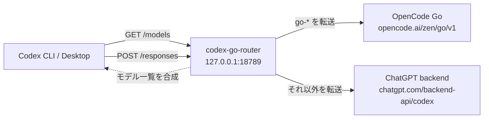

# codex-opencode-router

Codex はプロバイダを同時に1つしか使えないため、モデル一覧には「ChatGPT のモデル」か「OpenCode Go のモデル」のどちらかしか出せません。このリポジトリは、その制約をループバックの中継サーバーで回避する小さなリレーです。

- `GET /models` … ChatGPT のモデルカタログを取得し、OpenCode Go のモデルを追記して返す
- `POST /responses` … モデル名が `go-` で始まれば OpenCode Go へ、それ以外は ChatGPT へ転送する

Codex 側は `model_provider = "local-router"` を向くだけで、通常の GPT モデルと OpenCode Go のモデルを同じモデル一覧から選べます。



## AI エージェントにセットアップさせる

AI エージェント（Codex など）に任せる場合は、次のように伝えるだけで動きます。

> https://github.com/mattyatea/codex-opencode-router のセットアップをして

実行手順は [AGENTS.md](AGENTS.md) に定義しています。AI はこの README と AGENTS.md に従って、ビルド、常駐化、`~/.codex/config.toml` の設定、検証まで行います。AGENTS.md を直接読ませたい場合は https://raw.githubusercontent.com/mattyatea/codex-opencode-router/main/AGENTS.md を使ってください。

## 手動セットアップ（Linux の例）

```sh
git clone https://github.com/mattyatea/codex-opencode-router.git ~/.codex/codex-go-router
cd ~/.codex/codex-go-router
go build -o ~/.codex/bin/codex-go-router .

# API キー（Codex 本体と同じ .env を読む）
umask 077
printf 'export OPENCODE_GO_API_KEY=%s\n' "$OPENCODE_GO_API_KEY" >> ~/.codex/.env

mkdir -p ~/.config/systemd/user
cp deploy/codex-go-router.service ~/.config/systemd/user/
systemctl --user daemon-reload
systemctl --user enable --now codex-go-router.service
systemctl --user status codex-go-router.service
```

`~/.codex/config.toml` に追加する設定:

```toml
model_provider = "local-router"
model_reasoning_summary = "auto"

[model_providers.local-router]
name = "Local router"
base_url = "http://127.0.0.1:18789"
requires_openai_auth = true
wire_api = "responses"
supports_websockets = false
```

## 動作確認

```sh
codex debug models        # go-* のモデルが一覧に出る
codex exec --model go-gpt-6-luna 'Reply with OK only.'
codex exec --model go-deepseek-v4.1-flash 'How much is 17*23? Think briefly.'
```

## 設定

| 変数 | 既定値 | 説明 |
| --- | --- | --- |
| `OPENCODE_GO_API_KEY` | なし（必須） | `~/.codex/.env`、無ければプロセス環境変数から読む |
| `ROUTER_LISTEN` | `127.0.0.1:18789` | 待ち受けアドレス |
| `CODEX_HOME` | `~/.codex` | `.env` を探すディレクトリ |

## 対応モデル

`main.go` の `GO_MODELS` に定義しています。OpenCode Go 側で Responses API に対応しているモデルだけを載せてください（chat/completions 専用のモデルは `/responses` では 503 になります）。

| モデル ID | Codex での表示名 | 備考 |
| --- | --- | --- |
| `deepseek-v4.1-flash` | `Go/DeepSeek V4.1 Flash` | 生の reasoning を思考サマリーに変換して表示 |
| `gpt-6-luna` | `Go/GPT-6 Luna` | ネイティブの reasoning summary に対応 |
| `muse-spark-1.3-contributor` | `Go/Muse Spark 1.3 (Train)` | ワークスペースの Privacy 設定で学習許可が必要 |

## 注意

- OpenCode Go のモデルは `go-` 接頭辞で識別します。ChatGPT 側のカタログに同じ ID があっても衝突しません。
- DeepSeek 系は `reasoning_text` イベントを返すため、ルーターが Codex の描画する `reasoning_summary` イベントへ変換しています。
- ChatGPT の使用枠が上限に達していると、通常の GPT モデルは上流の 429 をそのまま返します。
- ルーターは 127.0.0.1 のみで待ち受け、認証はありません。マルチユーザーマシンでは注意してください。

## 開発

```sh
go vet ./...
go test ./...
```
